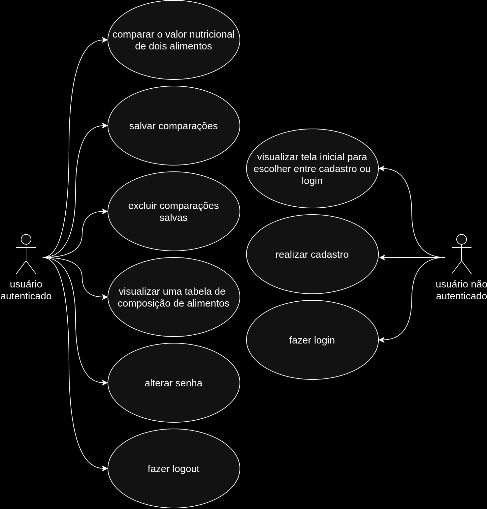
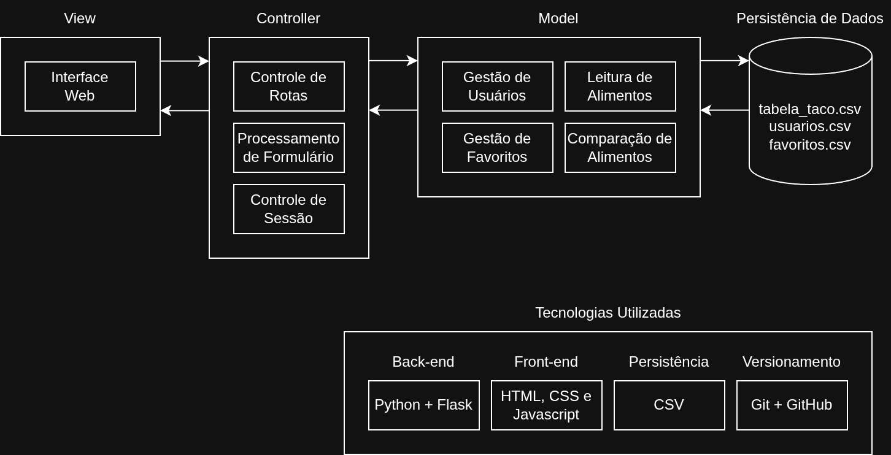

# TrocaPrato

TrocaPrato é uma ferramenta desenvolvida em Python Flask com o objetivo de amenizar a monotonia alimentar de pessoas que fazem acompanhamento nutricional.

A aplicação foi desenvolvida como projeto final das disciplinas de Programação Web I, Introdução a Programação e Introdução à Engenharia de Software, do curso de Engenharia de Software do IFPB.

## Funcionalidades

A ferramenta funciona de maneira simples: o usuário informa o nome e a porção em gramas do alimento que ele deseja substituir, e o nome do alimento que ele deseja consumir. A ferramenta não só retorna a equivalência calórica entre esses dois alimentos, como também faz um comparativo de seus valores nutricionais.

Além disso, é possível salvar as comparações, que ficam disponíveis numa lista de favoritos para serem consultadas posteriormente.

A ferramenta também conta com autenticação de usuário, incluindo: login, logout, cadastro, alteração de senha e restrição de acesso à rotas protegidas.

## Diagrama de Casos de Uso



## Arquitetura do Sistema



## Instalação

### 1. Clone o repositório

```bash
git clone https://github.com/gabriel-domonte/TrocaPrato.git
cd TrocaPrato
```

### 2. Crie um ambiente virtual

```bash
python -m venv venv
```

### 3. Ative o ambiente virtual

Windows:
```bash
venv\Scripts\activate
```

Linux/Mac:
```bash
source venv/bin/activate
```

### 4. Instale as dependências

```bash
pip install -r requirements.txt
```

### 5. Configure as variáveis de ambiente

Crie um arquivo **.env** na raiz do projeto e adicione o seguinte conteúdo:

```bash
SECRET_KEY=sua_chave_secreta_aqui
```

### 6. Execute a aplicação

```bash
python app.py
```